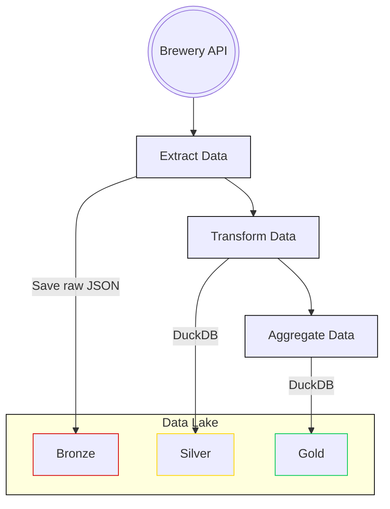

# brewery-data-lake

## Project Overview

This project fetches data from a brewery API and sets up an Airflow data pipeline to process and store the data in a data lake.

Using the medallion architecture for efficient data management.

## Prerequisites

- Python 3.12 or higher
- pip
- Docker (for running Airflow)

## Installation Guide

1. **Clone the Repository**:

   ```bash
   git clone https://github.com/nahumsa/brewery-data-lake.git
   cd brewery-data-lake
   ```

2. **Install Dependencies**:

   ```bash
   pip install -r requirements.dev.txt
   ```

3. **Set Up Airflow**:

   ```bash
   docker-compose up
   ```

3. **Access the Airflow UI**:
   - Open a web browser and go to `http://localhost:8080`.
   - Log in using the default credentials (airflow/airflow).

After logging to the airflow UI, you can see the whole data pipeline in the `DAG` called `brewery_dataset`,
or you can see by using the tags attached to the `DAG`, such as `producer`, `brewery`, etc.

## Data Pipeline Overview

The purpose of the pipeline is to fetch data from an API



The Airflow data pipeline consists of the following tasks:

- **Fetch Data**: Fetches data from the brewery API.
- **Transform Data**: Processes the fetched data (e.g., cleaning, transforming).
- **Store Data**: Stores the processed data in a data lake (e.g., S3).

