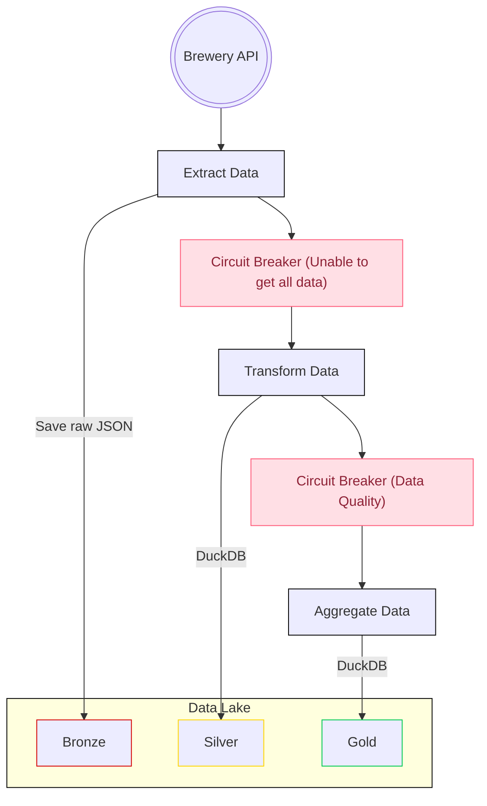

<h1 align="center">Brewery Data Lake</h1>
<p align="center">
<a href="https://github.com/nahumsa/brewery-data-lake/actions"></a>
<a href="https://github.com/psf/black"></a>
<a href="https://pycqa.github.io/isort/"></a>
<a href="https://github.com/astral-sh/ruff"></a>
</p>

## Project Overview

The purpose of this project is to design and implement an
Extract, Load, Transform (ELT) pipeline that fetches data
from the [Open Brewery DB](<https://api.openbrewerydb.org/>)
and utilizes a medallion architecture within a data lake.
The goal is to ensure efficient, scalable, and reliable data ingestion,
transformation, and storage.

The project leverages modern data engineering tools to orchestrate
workflows, manage large datasets, and optimize query performance.

### Orchestration & Processing

#### Airflow

Airflow is used as the orchestrator for the pipeline. It handles the
scheduling, monitoring, and execution of tasks in the pipeline,
ensuring that each step is performed in the correct order and
at the right time. Airflow also provides error handling, retries,
and logging, making it a reliable tool for managing complex workflows.

This project uses airflow features such as `Datasets`, `task_groups`, and
`ShortCircuit`.

#### DuckDB

DuckDB serves as the compute engine for querying and transforming the data.
It is an efficient, in-process SQL query engine that works seamlessly with
data stored in columnar formats such as Parquet or Delta. DuckDB can perform
fast analytical queries on large datasets, which makes it an ideal choice
for performing transformations at scale, especially within a data lake
environment. DuckDB's high-performance execution engine allows for the
execution of complex SQL queries without the need for external compute clusters.

## Prerequisites

- Python 3.12 or higher
- pip
- DuckDB
- Docker (for running Airflow)

## Installation Guide

1. **Clone the Repository**:

   ```bash
   git clone https://github.com/nahumsa/brewery-data-lake.git
   cd brewery-data-lake
   ```

2. **Install Dependencies**:

   ```bash
   pip install -r requirements.dev.txt
   ```

3. **Set Up Airflow**:
 If it's your first time running, you should run:
`echo -e "AIRFLOW_UID=$(id -u)" > .env`

   ```bash
   docker-compose up
   ```

3. **Access the Airflow UI**:
   - Open a web browser and go to `http://localhost:8080`.
   - Log in using the default credentials (airflow/airflow).

After logging to the airflow UI, you can see the whole data pipeline in the `DAG` called `brewery_dataset`,
or you can see by using the tags attached to the `DAG`, such as `producer`, `brewery`, etc.

## Data Pipeline Overview

The purpose of the pipeline is to fetch data from Open Brewery DB API,
load it to a Data Lake and transform it using a medallion architecture.
The data pipeline steps are illustrated in the following diagram:



Even though in the data data pipeline, we save the files
locally, it is completely possible to save it to any
blob storage by only changing some configuration on
DuckDB, Airflow's `Dataset` path and the `save_json` function.

### Pipeline Observability

Each step of the pipeline is monitored by a given Service Level Agreement (SLA)
that was defined by analyzing the runtime of each task. This will help monitor
the Data Pipeline and also show some potential improvements that could be done
for speeding up the Pipeline. When any SLA is not met, it is possible to
implement an alerting tool such an email or slack message for the responsible
for the pipeline by using the `sla_callback` function.

Also when there is any fail on the pipeline, an alerting can be sent, let's say
by email. This can be set up by adding the SMTP configuration on `airflow.conf`, for instance:

```bash
[email]
email_backend = airflow.utils.email.send_email_smtp
[smtp]
smtp_host = localhost
smtp_starttls = False
smtp_ssl = False
smtp_port = 25
smtp_mail_from = noreply@company.com
```

Or you could also: [configure to use GMail](<https://helptechcommunity.wordpress.com/2020/04/04/airflow-email-configuration/>).

### Pipeline Patterns

#### Circuit Breaker

In data pipelines, data quality issues can arise at various stages. When these issues
occur, continuing with data processing might lead to inaccurate analysis or
downstream failures.

Thus this projects implement a circuit breaker pattern which will halt the data processing
at an early stage when issues are detected.
This prevents bad data to propagate through the pipeline, making data quality a first-class
citizen. After the data quality issue is resolved, then the data pipeline can resume.

### Pipeline steps

#### Getting data from API and loading to the Bronze Layer

In order to save to the bronze layer, we must fetch the data from the Open
Brewery DB API, thus we must use two endpoint, one to understand the metadata
of the data being fetched (quantity, entries per page) and another to
fetch the data. Since Data Quality must be in the forefront, we must make sure
that the we fetch all the data, thus we make a check in the pipeline that all
data is fetched, if the quantity is different from what we gathered with the
API's metadata we should short-circuit the pipeline and then send a notification
for the person responsible for the pipeline.

The Data Quality is assessed by using a
[Pydantic](https://docs.pydantic.dev/latest/) Model
to make sure that columns that are used for partitions
(`country`, `state`, and `city`) are not null.
If any of the entries that are fetched from the API do not comply
with our data model, then the pipeline will fail.

#### Transformation and Loading to the Silver Layer

For the silver layer, we must read and process the data that was saved on the bronze layer.

In this pipeline we choose to use DuckDB as the compute engine
mainly because it is a lightweight and embedded database which makes it easier to
iterate locally. Another reason is that for the size
of the data that we have we do not need distributed compute such as Apache Spark, however
we could use the [same API as Spark](https://duckdb.org/docs/api/python/spark_api.html)
for transformations by using DuckDB making easier to debug locally spark pipelines without
the arduous set up that Apache Spark needs.

It is performed the following transformations for the dataset:

- Convert `brewery_type`, `city`, `state_province`, `state`, and `country` to lowercase mainly
because there could be upper case differences in the dataset which would not represent the
same values.
- Convert `longitude` and `latitude` to floats because it is important to keep the precision
needed for those variables since the number of decimal places represent the precision. Also
it's important to keep as float because requires less memory.
- Remove `website_url` that have `@gmail.com` which are emails and not URLs.

We also transform the data to Parquet and partition by `country`, `state`, and `city`
which makes it easier to query analytics pipelines regarding the location of the brewery
which is important for multiple reasons, for instance:

- Reducing the amount of data scanned, making cheaper, and speeds up query execution.
- Partitioning divides large datasets into smaller, manageable chunks.
This allows distributed systems to process different partitions in parallel,
leveraging the full power of cluster computing.
- Provides a hierarchical directory structure, making the dataset
easier to understand and manage.
- Partitioning makes it easier to append new data to specific partitions without rewriting
the entire dataset.

In this step of the pipeline we have the following data quality checks:

- `brewery_type` must have the values `'taproom', 'micro', 'contract',
'location', 'planning', 'bar', 'regional', 'large', 'beergarden', 'brewpub',
'proprietor', 'closed', 'nano'`.
- `id` must be unique for all values.

#### Aggregating data and loading to the Gold layer

In order to create an aggregated view with the quantity of breweries per type and
location we again use DuckDB for the compute engine and save the aggregated view
as a parquet file making it easy to use it. It was chosen not to partition
the data since it is small and small partitions make the read slower.
