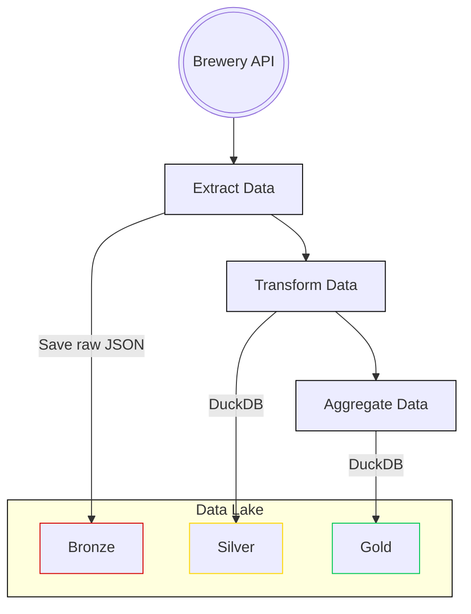

# brewery-data-lake

## Project Overview

This project fetches data from a brewery API and sets up an Airflow data pipeline to process and store the data in a data lake.

Using the medallion architecture for efficient data management.

## Prerequisites

- Python 3.12 or higher
- pip
- Docker (for running Airflow)

## Installation Guide

1. **Clone the Repository**:

   ```bash
   git clone https://github.com/nahumsa/brewery-data-lake.git
   cd brewery-data-lake
   ```

2. **Install Dependencies**:

   ```bash
   pip install -r requirements.dev.txt
   ```

3. **Set Up Airflow**:

   ```bash
   docker-compose up
   ```

3. **Access the Airflow UI**:
   - Open a web browser and go to `http://localhost:8080`.
   - Log in using the default credentials (airflow/airflow).

After logging to the airflow UI, you can see the whole data pipeline in the `DAG` called `brewery_dataset`,
or you can see by using the tags attached to the `DAG`, such as `producer`, `brewery`, etc.

## Data Pipeline Overview

The purpose of the pipeline is to fetch data from Open Brewery DB API,
load it to a Data Lake and transform it using a medallion architecture.
The data pipeline steps are illustrated in the following diagram:



### Pipeline Observability

Each step of the pipeline is monitored by a given Service Level Agreement (SLA)
that was defined by analyzing the runtime of each task. This will help monitor
the Data Pipeline and also show some potential improvements that could be done
for speeding up the Pipeline. When any SLA is not met, it is possible to
implement an alerting tool such an email or slack message for the responsible
for the pipeline by using the `sla_callback` function.

Also when there is any fail on the pipeline, an alerting can be sent, let's say
by email. This can be set up by adding the SMTP configuration on `airflow.conf`, for instance:

```bash
[email]
email_backend = airflow.utils.email.send_email_smtp
[smtp]
smtp_host = localhost
smtp_starttls = False
smtp_ssl = False
smtp_port = 25
smtp_mail_from = noreply@company.com
```

or you could also: [configure by GMail](<https://helptechcommunity.wordpress.com/2020/04/04/airflow-email-configuration/>).

### Pipeline steps

#### Bronze

In order to save to the bronze layer, we must fetch the

